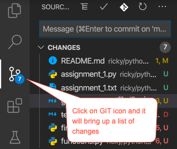

# Git Commands

## Use Visual Studio for Git Commands





## Use Command Line for Git Commands

This [article](https://www.hostinger.com/tutorials/basic-git-commands) has instructions on some basic GIT commands.

Here are the basic ones that you will use often:

```bash
git clone <url to repo>
git add --all  # adds all changed files to the staging area
git commit -m "A message to go with the commit"
git push # push the changes to the remote repo (i.e. github)

git checkout <branch_name>  # check out a specific branch

git pull # pulls the latest changes from the remote branch to your local
```

Another option is to use Visual Studio Code instead of the command-line:

